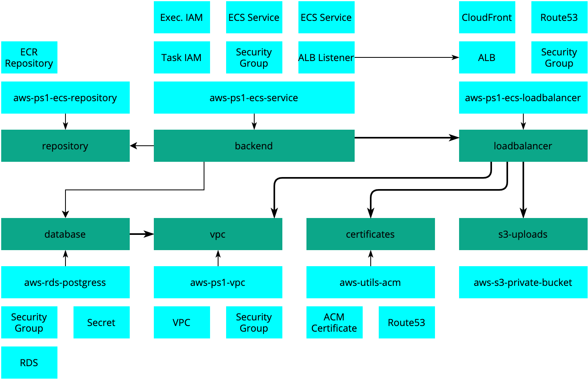

# Infrastructure

This project has its infrastructure maintained with Terraform and
Terragrunt.

This setup is based on PovioLabs SP1 SPA template. For more
information, please check out https://github.com/poviolabs/terraform-template/

Read more about Terraform in the engineering-handbook [terraform section](https://github.com/poviolabs/engineering-handbook/tree/master/general-guidelines/infrastructure/terraform) .
and more about infrastructure in general in the [infrastructure section](https://github.com/poviolabs/engineering-handbook/tree/master/general-guidelines/infrastructure).

## Usage

0. Copy the example infrastructure folder structure into myapp-infrastructure repository and adapt it to suit project naming, stages, etc...
1. Copy the `modules` folder into myapp-infrastructure repository root folder.
1. Update the `project_vars.yml` and `stage_vars.yml` files.
2. Follow the instructions to prepare an IAM user and any other AWS resources you might need (Route53, SSM).
3. Follow the instructions to use install `terraform` `terragrunt` OR use the included `docker.sh` script (recommended, requires docker and docker-compose installation).
4. Run `terragrunt init` to initialize the s3 bucket and dynamodb database.
5. Set up the applications one by one, updating the configuration as required, using `terragrunt apply` in each.

- ./stages/myapp-dev/certificates
- ./stages/myapp-dev/webapp

## Setting up CI

For deployments, a group will be made with permissions to deploy to a stack.

Creating a user and adding it to those groups, will allow you to use a single, limited
user for your CI.

Backend application creates a limited IAM user that can be used with CI. You can get the IAM
user details by inspecting the backend terragrunt/terraform outputs - run `terragrunt output -json` in backend folder.
